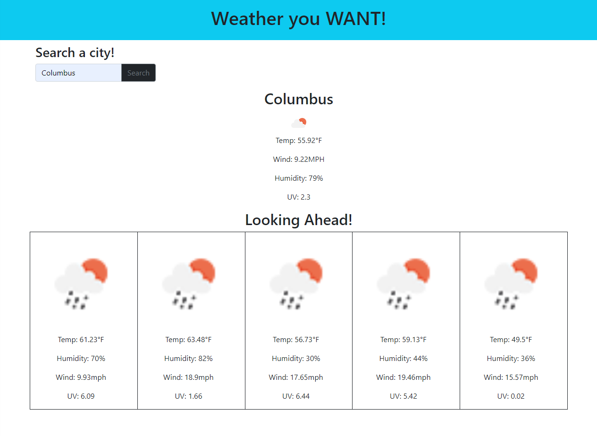

<h1 align="center">Forcast Follower</h1>

## 

- [About](#about)
- [Usage](#usage)
- [Built With](#built_using)
- [Authors](#authors)
- [Questions](#questions)
- [Screenshots](#screenshots)

## 

Forcast follower is a weather app using the OneCall API to bring you current and future weather data at the place of your choosing!

## 

To use this app simply launch it from the url and enter a city you would like to check!

## 

- Javascript
- CSS
- HTML

## 

- [ileachy](https://github.com/ileachy)

## 

Regarding any questions, feel free to email me or add an issue to the repo as needed.

## 

